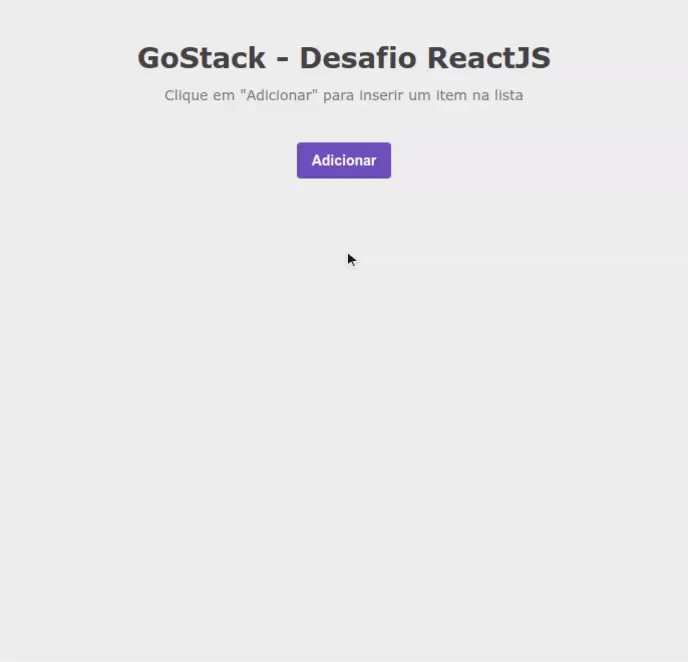

# GoStack - Desafio React Js - 

Projeto para a aplicação dos conceitos iniciais de ReactJS utilizando o Backend em NodeJs criado no desafio anterior.

## Requisitos de aprovação :

- [x] O componente da aplicação deve ser capaz de adicionar item;
- [x] O componente da aplicação deve ser capaz de remover item;

### BackEnd da Aplicação 
- [Repositório - Desafio NodeJs]([https://github.com/leovdn/gostack-desafio-nodejs])
